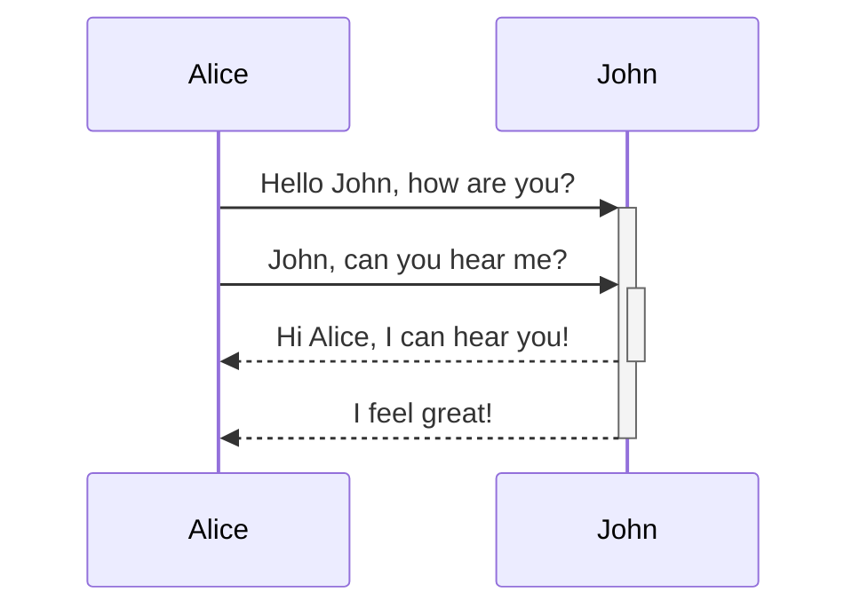

## Code-Formatierung

```python
print("Hallo")
```

## Callouts

> [!info] Title
> 
> This is a callout!

## Hightlights

_Dieser_ __Text__ ist ==hervorgehoben==.

## mermaid Diagramme



## Mathematik

$e^{i\pi} = -1$

$$
f(x) = \int_{-\infty}^\infty
    f\hat(\xi),e^{2 \pi i \xi x}
    \,d\xi
$$


[[content/index]]

![[Sommer.png]]