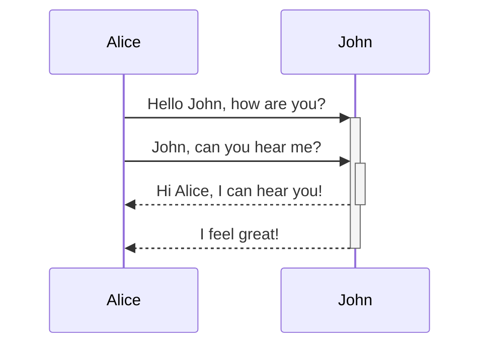

## Code-Formatierung

```python
print("Hallo")
```

## Callouts

> [!info]- Ein Callout
> 
> Dies ist ein Callout!

## Hightlights

_Dieser_ __Text__ ist ==hervorgehoben==.

## mermaid Diagramme



## Mathematik

Diese Formel ist inline $e^{i\pi} = -1$, wie man sieht.

Die folgende Formel ist zentriert:

$$
f(x) = \int_{-\infty}^\infty
    f\hat(\xi),e^{2 \pi i \xi x}
    \,d\xi
$$


[[content/index]]

![[Sommer.png]]